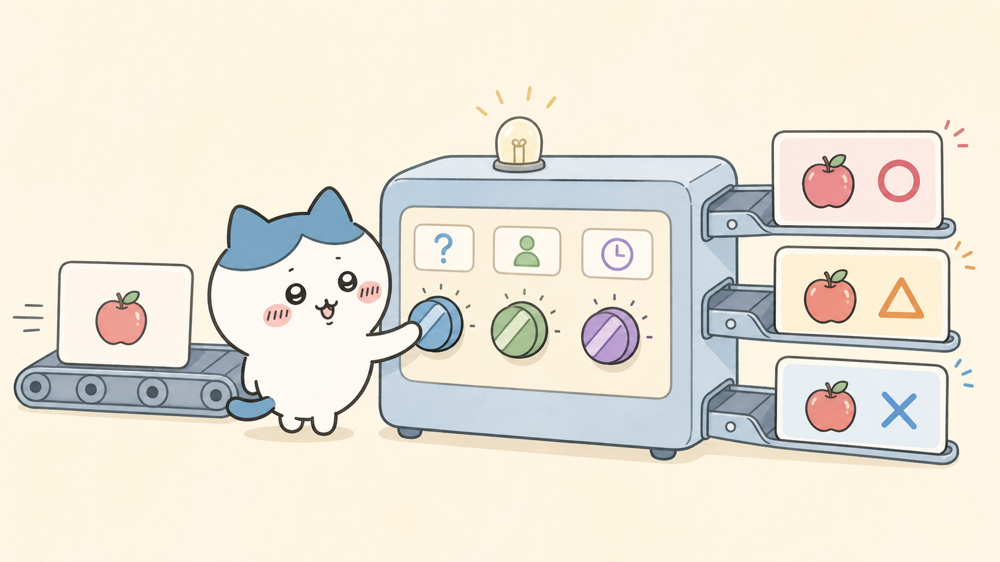
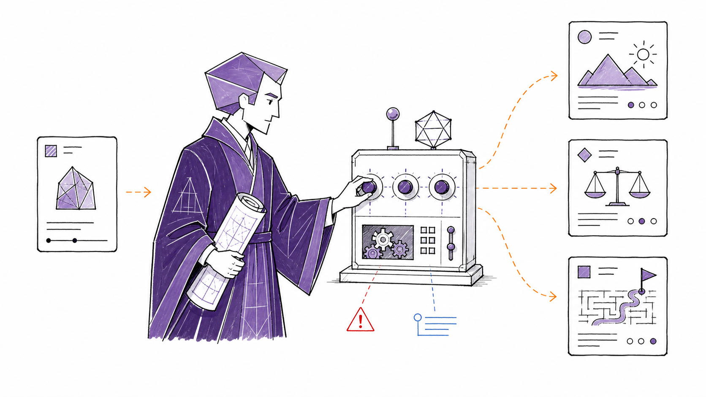
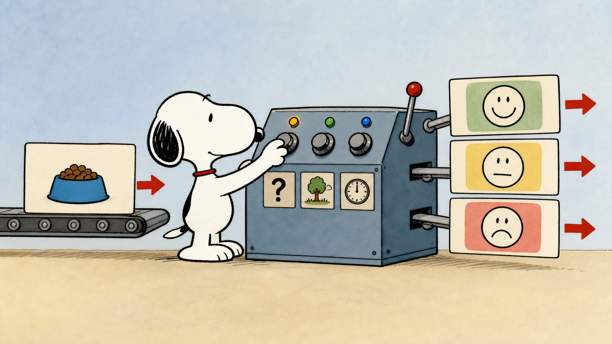
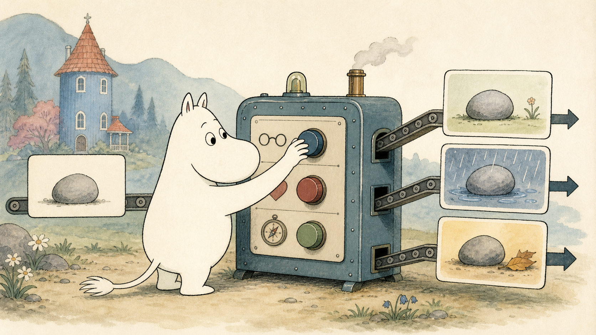

# IP Explainer Illustrations

用统一的知名 IP 主角，把中文拆书笔记、文章、工作流和抽象概念变成一组清楚、有连续感的解释图。

这个 Codex skill 会先锁定 **IP 家族 → 角色 → 画风**，再用 **GPT-image-2** 生成系列插图。它为「角色身份」和「画风」分别建立锚点，使同一组图里的主角、比例、配色与线条保持一致。

> 这是一个用于创作说明性视觉内容的工具；IP 名称与角色权利仍归各自权利人所有，且不代表任何官方合作或背书。详见 [NOTICE.md](NOTICE.md)。

## 示例

<table>
  <tr>
    <td width="50%"></td>
    <td width="50%"></td>
  </tr>
  <tr>
    <td align="center">Chiikawa 家族：轻快、可爱的选择机制</td>
    <td align="center">MBTI / INTJ：几何感的结构化解释</td>
  </tr>
  <tr>
    <td width="50%"></td>
    <td width="50%"></td>
  </tr>
  <tr>
    <td align="center">Peanuts：Snoopy 的温暖手绘感</td>
    <td align="center">Moomin：北欧水彩童话氛围</td>
  </tr>
</table>

## 安装

将仓库克隆到 Codex skills 目录：

```bash
git clone https://github.com/Niko77066/ip-explainer-illustrations.git \
  "$CODEX_HOME/skills/ip-explainer-illustrations"
```

重启或刷新 Codex 后，直接在对话中提出生成需求即可。也可以把仓库放在任意本地目录，再按你的 Codex skill 管理方式安装。

## 怎么使用

如果你还没选 IP，skill 会先问你想用哪个 **IP 家族**；选定家族后再确认具体角色。若你已经在请求中写明，则直接开始创作。

最简用法：

```text
用 TWINKLE TWINKLE 为这段拆书笔记生成 4 张解释图：
[粘贴内容]
```

也可以把角色、画面数量和主题一次说清：

```text
用 Moomintroll 解释这个工作流，生成 5 张组图；
每张图只讲一个步骤，整体使用姆明动画般的北欧水彩氛围。
```

支持上传你已获授权的角色或人物图片，并转换为 Q 版讲解主角：

```text
以我上传的形象为主角，做成 Q 版；
用这篇文章生成 3 张流程解释图，保留干净的手绘线稿风格。
```

### 一次生成时，skill 会做什么

1. 把内容切成 3–6 个可视化概念，每张图只承担一个清楚的解释任务。
2. 选定角色后固定身份锚点（轮廓、比例、关键配饰、主色）。
3. 选定家族的画风锚点（线条、色彩、背景密度、情绪），再逐张生成。
4. 在每张图中保留同一个主角，以物件、机器、路径、卡片或场景来承载抽象概念。

### 一致性建议

- 想让角色尽可能贴近原形：提供 1–3 张清晰、已获授权的角色参考图。
- 想让整套图更统一：一次只选一个角色与一套画风，并在同一轮内生成。
- 未提供角色图时，skill 会用内置授权参考图库做近似锚定；生成结果是创作性诠释，不保证逐像素复刻。

## 支持的 IP 矩阵

| 家族 | 可选主角 | 数量 | 默认画风锚点 |
| --- | --- | ---: | --- |
| POP MART | LABUBU、MOLLY、SKULLPANDA、DIMOO、HIRONO、CRYBABY、**TWINKLE TWINKLE** | 7 | 官方产品视觉为身份参考；简笔画讲解风格 |
| Sanrio | Hello Kitty、My Melody、Kuromi、Cinnamoroll、Pompompurin、Pochacco、Little Twin Stars、Hangyodon、Tuxedosam、Kerokerokeroppi、Badtz-maru、Chococat、Gudetama、Aggretsuko、Pekkle | 15 | Sanrio 动画式圆润线条与明快色块 |
| Chiikawa | Chiikawa、Hachiware、Usagi、Momonga、Rakko、Shisa、Kurimanju、Furuhonya / Kani | 8 | 轻线条、留白、软萌日常感 |
| Peanuts | Snoopy、Charlie Brown、Woodstock、Lucy、Linus、Sally、Schroeder、Franklin、Peppermint Patty、Marcie、Pigpen、Rerun、Shermy | 13 | 经典报纸漫画线稿与温暖平涂 |
| Moomin | Moomintroll、Moominmamma、Moominpappa、Snorkmaiden、Snufkin、Little My、Sniff、Stinky、The Groke、Hattifatteners、Too-Ticky、Hemulen、Mymble、Fillyjonk、Thingumy and Bob | 15 | 北欧童话感、水彩纸张肌理与自然场景 |
| Jellycat | Bartholomew Bear、Bashful Beige Bunny、Jellycat Jack、Timmy Turtle、Ricky Rain Frog、Fergus Frog、Peanut Penguin、Smudge Rabbit、Fuddlewuddle Elephant、Fuddlewuddle Lion、Amuseables Coffee Bean、Amuseables Sun、Amuseables Cloud、Amuseables Croissant、Sky Dragon | 15 | 官方产品视觉为身份参考；简笔画讲解风格 |
| MBTI / 16Personalities | INTJ、INTP、ENTJ、ENTP、INFJ、INFP、ENFJ、ENFP、ISTJ、ISFJ、ESTJ、ESFJ、ISTP、ISFP、ESTP、ESFP | 16 | 16Personalities 几何角色语言与紫绿蓝配色体系 |
| 自定义上传 | 你拥有授权的 IP、品牌吉祥物、人物肖像或原创角色 | 不限 | 由你提供的参考图决定；也可指定默认简笔画风格 |

完整角色清单、参考图来源和每个家族的路由规则见 [references/ip-catalog.md](references/ip-catalog.md)。

## 参考图库与授权记录

仓库内的 [`assets/authorized-reference-library`](assets/authorized-reference-library) 保存身份参考与画风参考；每个家族目录都带有 `source.md` 记录。汇总清单位于 [references/authorized-reference-sources.json](references/authorized-reference-sources.json)。

这套资料库仅作为生成时的视觉锚点。使用者应确保自己对上传内容、参考素材和最终发布方式拥有所需权利，并遵守适用的平台规则与权利人条款。

## 技术约定

- 图像生成：**GPT-image-2**。
- 内容类型：中文拆书笔记、文章正文、方法论、工作流、结构图、状态变化、抽象观点。
- 输出形式：单张解释图或 3–6 张连续组图；默认不在画面内强塞大段文字。
- 无动画风格可用的家族：采用统一、干净的默认简笔画解释风格。

## 许可

本 skill 的代码与文字说明采用 [LICENSE](LICENSE) 所列许可。第三方 IP、商标、角色形象及其相关素材不随本仓库获得授权；请阅读 [NOTICE.md](NOTICE.md)。
